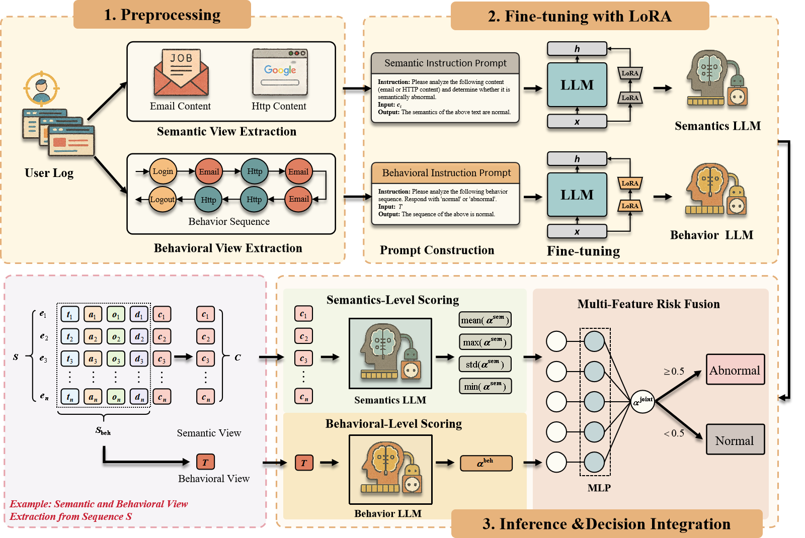
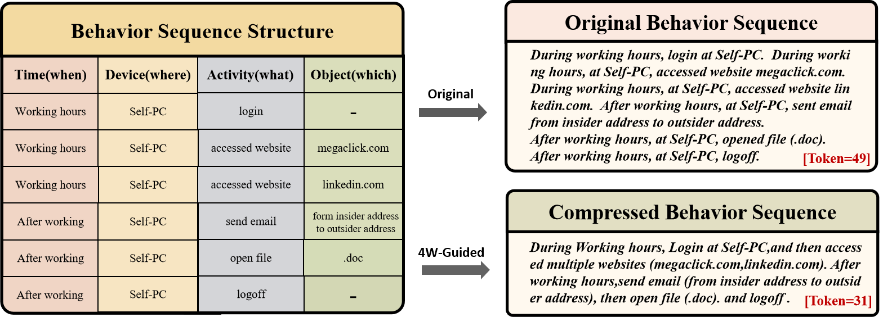

# Dual-Modality Insider Threat Detection (DMFI) 

This repository contains the source code and instructions for reproducing the results of our paper submitted to [a top-tier data mining conference in 2025].

> Note: For anonymity, author and affiliation information have been removed.

## Contents
- Preprocessing scripts for CERT dataset
- LoRA fine-tuning pipeline using LLaMA-Factory
- Semantic/Behavioral prompt generation
- Evaluation code and baseline comparisons

The full architecture is shown in the PDF below:

## Preprocessing Pipeline

Illustrative example of behavior sequence compression. 
The left table organizes raw user actions using the 4W schema (When, Where, What, Which).
On the right, we compare the original verbose sequence with a compressed version generated by our 4W-guided abstraction strategy.
While the original form enumerates each atomic behavior separately, the compressed version merges related actions into concise natural language.
This reduces token length (from 49 to 31 in this case) while retaining key behavioral semantics. 
