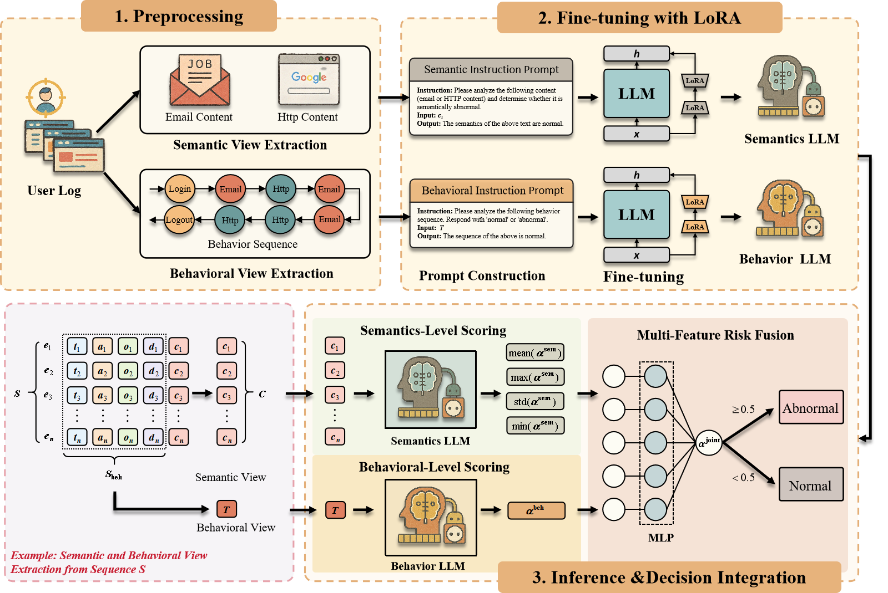
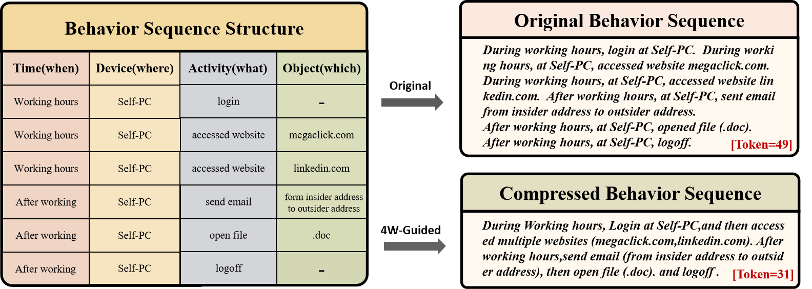

[English](./README.md) | [简体中文](./README_CN.md)

# 双模态内部威胁检测框架（DMFI）

本仓库提供论文《DMFI: A Dual-Modality Log Analysis Framework for Insider Threat Detection with LoRA-Tuned Language Models》的源码实现与实验复现说明。  

该论文已投稿至 ICDM 2025（IEEE International Conference on Data Mining）。

---

# 📌 项目内容

本项目主要包括：

- CERT 数据集预处理脚本
- 基于 LLaMA-Factory 的 LoRA 微调流程
- 语义 / 行为双模态 Prompt 构建
- 模型评估与基线对比代码

---

# 🧠 整体框架

整体框架如下图所示：



DMFI 是一种融合语义推理与行为建模的双模态内部威胁检测框架。

该方法将原始日志分别转换为：

- 语义模态（Semantic Modality）
- 行为模态（Behavioral Modality）

随后分别进行大语言模型微调，并通过轻量级决策模块完成融合判别。

---

# 🔄 日志预处理流程



上图展示了行为序列压缩示例。

左侧表格基于 4W（When、Where、What、Which）结构对原始用户行为进行组织。

右侧对比了：

- 原始冗长行为序列
- 基于 4W 引导生成的压缩行为描述

相比逐条枚举原子行为的原始形式，压缩后的自然语言描述能够：

- 有效减少 Token 长度
- 保留关键行为语义
- 提升大语言模型推理效率

示例中 Token 数量由 49 降低至 31。

---

# 🗂️ 项目目录结构

```bash
dmfi/
├── assets/
├── deployment/
│   └── README_DeepSeek_Finetuning.md
├── preprocess/
│   ├── features/
│   │   ├── behavior_sequence/
│   │   ├── semantic_content/
│   │   └── alpaca/
│   └── output/
│       ├── log_split/
│       └── log_merged/
├── step1_log_split.py
├── step2_log_merge.py
├── step3_log_labeling.py
├── step4_1_sequence_feature_engineering.py
├── step4_2_semantic_feature_engineering.py
├── step5_alpaca_feature_engineering.py
├── utils_for_feature.py
└── config.yaml
```

---

# 🤖 大语言模型微调

## ✅ 运行环境

### 硬件环境

- 4 × NVIDIA L20 GPU
- 512 GB 内存
- Intel Xeon Gold 6430

### 软件环境

- Ubuntu 20.04 LTS
- Python 3.8.10
- CUDA 12.4
- LLaMA-Factory 0.9.3.dev0

---

# 🔽 模型下载

```bash
git lfs install
git clone https://huggingface.co/deepseek-ai/DeepSeek-R1-Distill-Qwen-7B
```

或者访问：

https://huggingface.co/deepseek-ai

---

# 🚀 训练环境部署

```bash
git clone --depth 1 https://github.com/hiyouga/LLaMA-Factory.git

conda create -n llama_factory python=3.8

conda activate llama_factory

cd LLaMA-Factory

pip install -i https://pypi.tuna.tsinghua.edu.cn/simple -e .[metrics]

llamafactory-cli version
```

随后请参考：

```bash
deployment/README_DeepSeek_Finetuning.md
```

完成模型微调配置。

---

# 🔍 推理输入格式

```json
{
  "instruction": "Please analyze the following behavior sequence...",
  "input": "During working hours at Self_PC, logon, then access multiple websites (megaclick.com, linkedin.com)...",
  "output": "Anomaly Score = 1.00, Prediction = “Abnormal”"
}
```

---

# 📊 实验数据集

本项目主要在以下数据集上进行实验：

- CERT r4.2
- CERT r5.2

评估指标包括：

- Precision
- Recall
- F1-score
- Accuracy

---

# 👥 作者

- 孔凯传（Kaichuan Kong）
- 刘东杰（Dongjie Liu）
- 耿光刚（Guanggang Geng）

---

# 🏫 作者单位

暨南大学（Jinan University）  
网络空间安全学院（College of Cyberspace Security）  
中国 · 广州

---

# ⚠️ 使用声明

本项目仅用于学术研究、教学实验与科研复现。

项目中涉及的数据集（如 CERT 数据集）均遵循其原始许可协议使用。  

作者及所属单位不对因使用本项目所造成的任何直接或间接后果承担责任。
